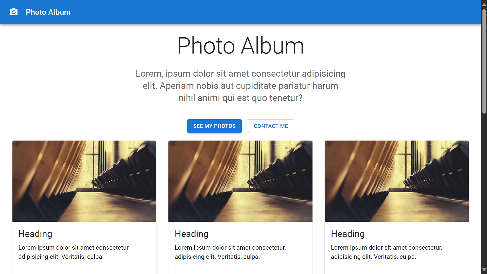

# 📸 Photo Album

## Overview

This is a simple Photo Album application built using React and Material UI. The application allows users to view a collection of photos in a visually appealing and responsive layout.

## 🔗 Project URL

Check out the live version of the project here: [Photo-Album](https://photo-album-material-ui.netlify.app/)

## 🖼️ Screenshots

## 🛠️ Technologies Used

- **React:** A JavaScript library for building user interfaces.
- **Material UI:** A popular React UI framework for building stylish and responsive components.

## ✨ Features

- **Responsive Design:** The layout is fully responsive, ensuring a great experience on both desktop and mobile devices.
- **Material UI Components:** Utilizes Material UI for a modern and clean user interface.

## 🚀 Getting Started

To run this project locally, follow these steps:

1. Clone the repository: `git clone https://github.com/Developer-Bilal/photo-album-material-UI.git`
2. Navigate to the project directory: `cd photo-album-material-UI`
3. npm install
4. npm start

The application should now be running on http://localhost:3000.

## 📧 Contact

If you have any questions or suggestions, feel free to reach out:

- Email: bilalchanna67@gmail.com ✉️
- LinkedIn: [Profile](https://www.linkedin.com/in/Engineer-Bilal-Channa) 💼
